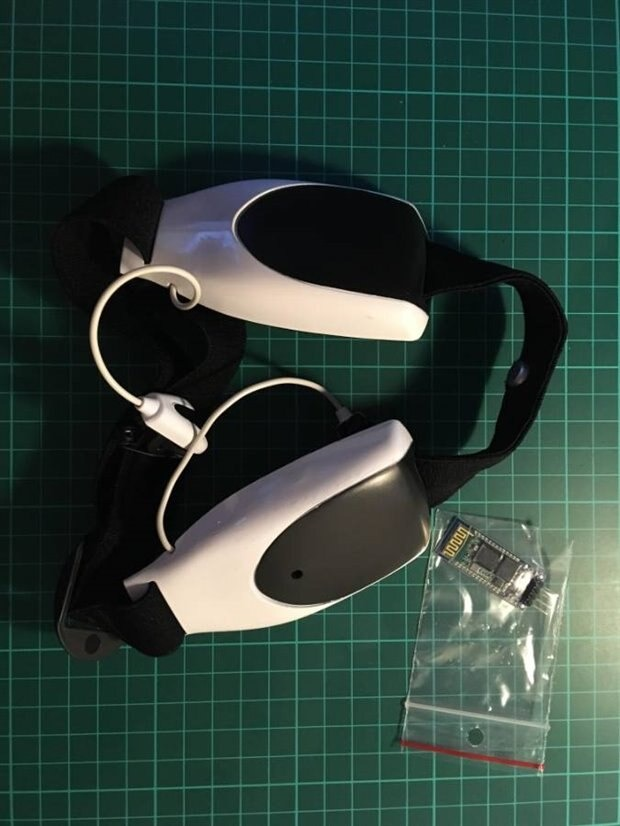
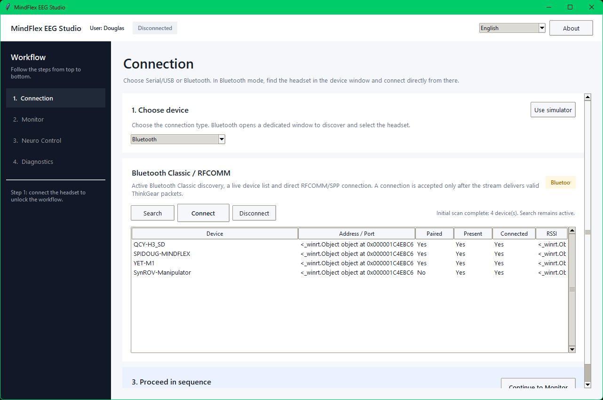
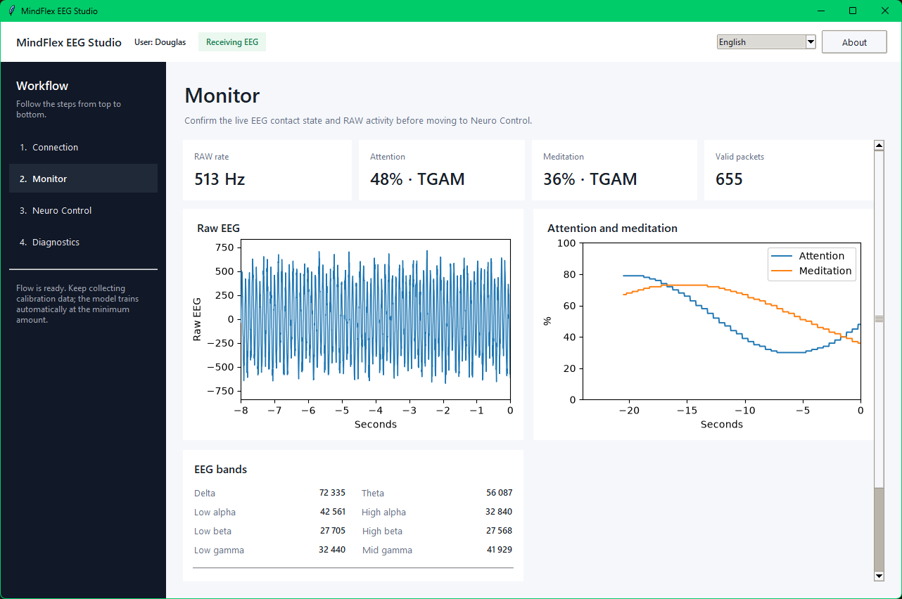
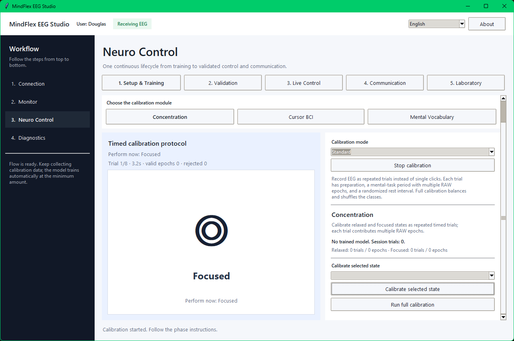
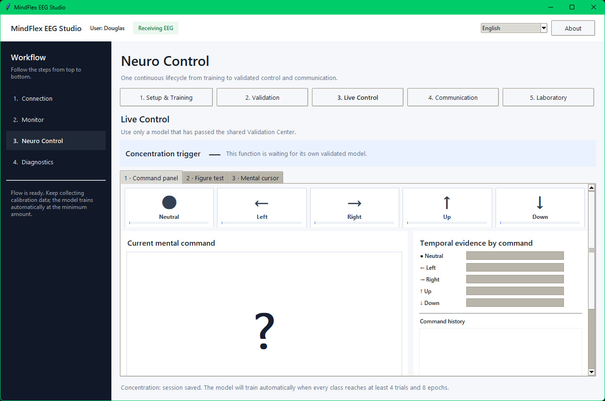
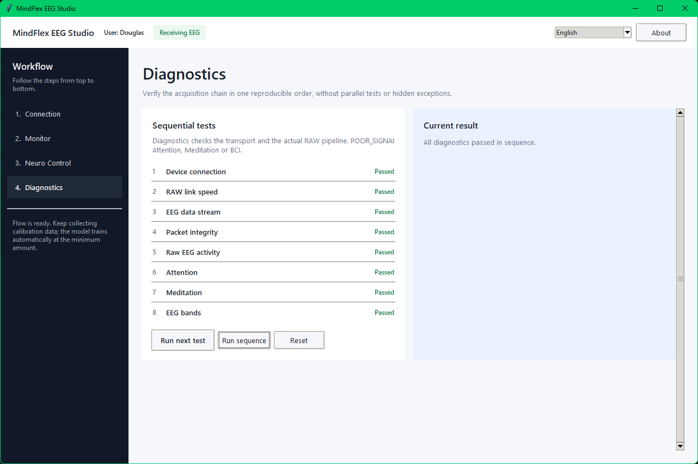

# MindFlex EEG Studio

MindFlex EEG Studio is a desktop application for MindFlex/TGAM EEG acquisition, monitoring, diagnostics, BCI calibration, validation, live neural control and communication experiments.

Version 1 accepts either the complete eight-band EEG summary produced by the TGAM or a complete RAW window. RAW processing applies Hampel correction, artifact rejection, linear detrending, a zero-phase 0.5–50 Hz band-pass response and a 60 Hz mains notch. The protocol's `POOR_SIGNAL` value is presented to users as **Contact quality** and remains informative rather than blocking neural capture.

The repository uses one data architecture for Bluetooth Classic, Serial/USB and simulation: transports deliver bytes, one controller interprets ThinkGear, and every feature consumes the same canonical EEG state.



## Application screenshots

| Connection and Bluetooth discovery | Live EEG monitor |
| --- | --- |
|  |  |

| Neural Control training | Neural Control live command workspace |
| --- | --- |
|  |  |

### Diagnostics



## Hardware requirement

RAW output is optional for BCI operation when the TGAM already publishes all eight EEG-band values. To monitor and process the waveform too, configure the TGAM1 for **57,600 baud with RAW output**. The documented startup-pad combination is **BR1=VCC, BR0=GND**. The M pad selects the hardware notch filter: **VCC=60 Hz**, **GND=50 Hz**.

Full connector tables, voltage precautions, photographs and the pad diagram are in [docs/HARDWARE_SETUP.md](docs/HARDWARE_SETUP.md).

## Requirements

- Python 3.10 or newer.
- MindFlex/TGAM ThinkGear stream providing either all eight EEG bands or RAW at approximately 512 samples/s.
- Windows 10/11 for direct Bluetooth Classic discovery and RFCOMM/SPP through WinRT.
- Or a supported Serial/USB endpoint for explicit serial acquisition.

Install dependencies:

```bash
python -m pip install -r requirements.txt
```

Run on Windows:

```bat
RUN_STUDIO.bat
```

Or run directly:

```bash
python -m mindflex
```

The Unix shell launcher is also included for simulator/development use:

```bash
./RUN_STUDIO.sh
```

## Data path

The core flow is:

`Transport → ingestion buffer → ThinkGearParser → EEGController → Monitor / Diagnostics / Recorder / BCI`

Key rules:

- Transport code never owns persistent EEG state.
- `EEGController` is the single state owner.
- RAW epoch timing is based on the fixed 512 Hz sample sequence, not Windows packet chunk size.
- Native TGAM Attention/Meditation and EEG bands are preferred while usable; RAW-derived continuity metrics are shown as `RAW*` when summary rows are unavailable.
- The technical `POOR_SIGNAL` value is displayed as an intuitive 0–100% **Contact quality** metric and does not independently block BCI capture.
- BCI feature extraction prefers complete native TGAM bands and falls back directly to a complete filtered RAW window.

See [docs/ARCHITECTURE.md](docs/ARCHITECTURE.md) for module-level responsibilities and persistence rules.

## Bluetooth Classic

The Connection page maintains a live Windows `DeviceWatcher` list. After the user selects a device, the Bluetooth worker:

1. stops discovery for the connection attempt;
2. pairs if required;
3. opens the detected `BluetoothDevice`;
4. queries the Serial Port Profile / RFCOMM service (`0x1101`), including uncached discovery routes;
5. applies timeouts to discovery/open operations;
6. probes candidate channels and accepts a route only after valid ThinkGear packets are observed;
7. keeps the confirmed `StreamSocket` open for continuous acquisition.

Bluetooth mode does not depend on a virtual COM port. `pyserial` is used only for the explicit Serial/USB mode.

## Monitor and diagnostics

The Monitor displays RAW activity, Attention, Meditation and eight EEG bands. The source indicator distinguishes native TGAM metrics from locally derived `RAW*` continuity values.

Diagnostics checks the subsystems independently: connection, fixed 57,600-baud configuration, ThinkGear stream, checksum integrity, RAW activity/rate, Attention, Meditation and EEG bands. A failure in one diagnostic does not prevent the remaining checks from running.

## BCI calibration and validation

Training is organized as balanced timed trials:

`Prepare → mental task → EEG-band updates → rest`

| Mode | Training trials/class | Validation trials/class | Prepare | Task | Epoch | Epoch step |
| --- | ---: | ---: | ---: | ---: | ---: | ---: |
| Quick | 4 | 3 | 1.5 s | 4 s | 2 s | 1 s |
| Standard | 8 | 5 | 2 s | 5 s | 2 s | 1 s |
| Research | 15 | 8 | 3 s | 6 s | 2 s | 1 s |

Version 1 uses one fixed 18-feature BCI format derived from each complete eight-band EEG update. It contains log powers, relative theta/alpha/beta/gamma power, band ratios, entropy, centroid, total power and engagement. Updates from the same timed cue are averaged into one trial vector before training, so every independent trial has equal model weight. The classifier applies class-balanced z-score normalization across trial vectors and learns one centroid per class.

Validation is also scored once per independent trial. A model is approved only when it reaches at least 70% global accuracy, at least 60% accuracy in every class, and at least 3 independent validation trials for every class. Approval is bound by SHA-256 to both the exact model and the exact validation session, and validation is recomputed from the saved validation session during restore.

Sessions, models and validation metadata are saved automatically inside the active user's isolated data directory. A model is also bound to the exact trial-balanced training-session fingerprint; if the stored model and training data diverge, the model is rejected and can be rebuilt from a sufficient valid session.

## Neural Control workspace

The Neural Control interface is designed around the visual task rather than explanatory panels:

- **Setup & Training:** one selected module at a time with a large cue canvas and compact side controls.
- **Validation:** a large active cue/prediction area plus a narrow results/actions sidebar.
- **Live Control / Command panel:** large current-command visualization, simultaneous command figures, evidence and event history.
- **Live Control / Figure test:** large target cue with accumulated multi-window prediction, score and confusion matrix.
- **Live Control / Mental cursor:** large cursor arena with target/trajectory and a compact evidence/actions sidebar.

At narrow widths the primary and secondary panes stack instead of compressing the visual surface.

## Languages

The program keeps its runtime language system. Supported catalogs are English, Brazilian Portuguese, Spanish, French, German, Italian and Japanese. English is the canonical source catalog; every locale is checked for key parity, non-empty values and matching format placeholders.

Source code and comments remain English. Localized text belongs in `mindflex/locales/*.json`.

## User data

On the first startup the application requires the person's full name. On later startups it presents the saved people as a list ordered by most recent use, with a **New person** action for creating another isolated profile. A deterministic per-person namespace stores profile metadata, calibration sessions, models and communication metadata under the application configuration directory (`%APPDATA%/mindflex-eeg-studio` on Windows, or the platform equivalent).

The repository starts without saved people or sessions. The profile selector provides a confirmed delete action that permanently removes only the selected person's isolated data.

Invalid model/session schemas, algorithms, feature definitions, fingerprints and malformed/non-finite values are rejected. BCI acquisition accepts either a recent complete eight-band update or a complete active RAW window.

## Safety and intended use

MindFlex EEG Studio is an experimental EEG/BCI software project. It is not a medical device and must not be used for diagnosis or medical decision-making. When modifying the headset, disconnect power before soldering and verify TGAM1/adapter voltage compatibility before connection.
