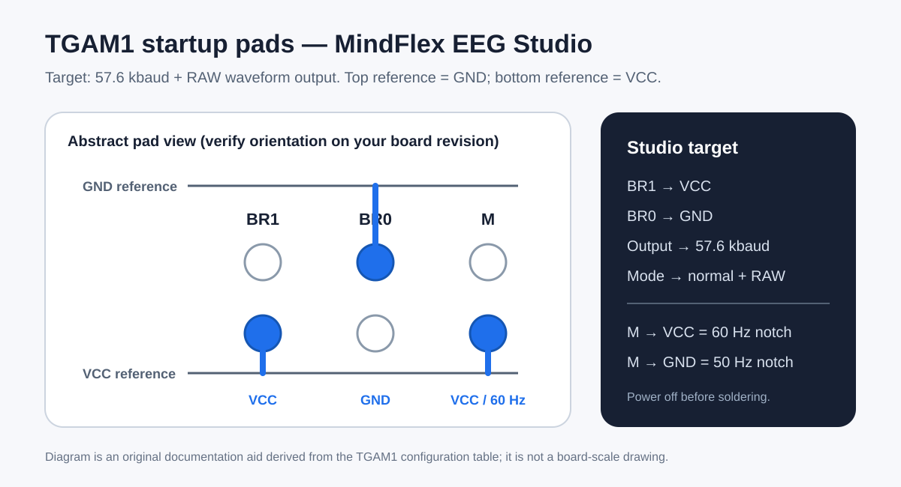
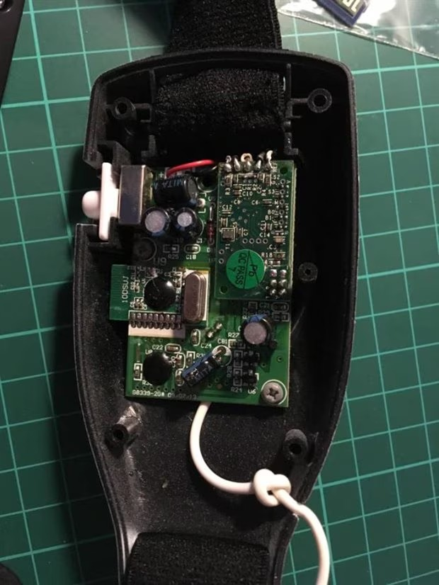
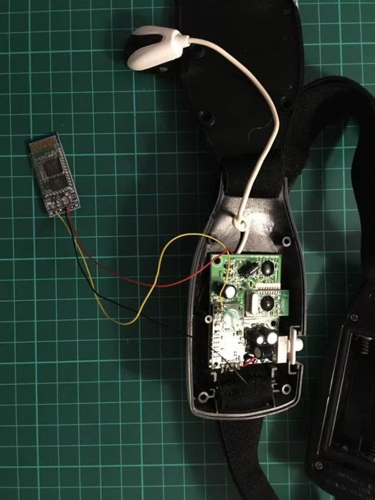
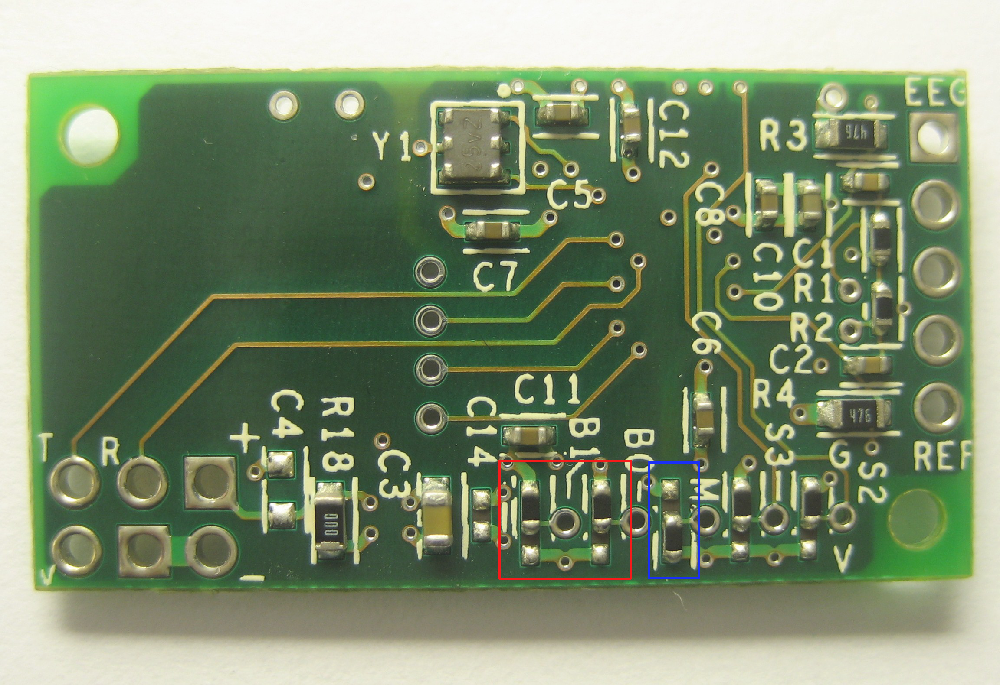

# MindFlex / TGAM1 hardware setup

This guide documents the hardware configuration expected by MindFlex EEG Studio. It is written for the NeuroSky ThinkGear-AM **TGAM1** module commonly found in MindFlex headsets. Board revisions and third-party adapters vary, so identify the labels on your own board before soldering.

The primary hardware reference used for this repository is the MyRedStone TGAM module development documentation: <https://www.myredstone.top/en/archives/5135>. That reference identifies the module as TGAM1, specifies a 2.97–3.63 V operating range, lists the UART/electrode connector pins, and documents the BR0/BR1/M startup pads.

## Required startup mode for this software

MindFlex EEG Studio expects **57,600 baud** and uses the RAW waveform stream (approximately 512 samples/s). According to the TGAM1 pad table, that startup mode is selected with:

- **BR1 → VCC**
- **BR0 → GND**
- Result: **57.6 kbaud, normal data + RAW waveform**

For the notch filter:

- **M → VCC** selects **60 Hz**.
- **M → GND** selects **50 Hz**.

Brazilian power systems use 60 Hz, so **M → VCC** is the appropriate default for typical use in Brazil. If the headset is used in a 50 Hz region, use the 50 Hz setting instead. ANEEL publishes limits and guidance that explicitly cover Brazilian 60 Hz installations: <https://www.gov.br/aneel/pt-br/assuntos/seguranca/campos-eletricos-e-magneticos>.

> The pad drawing above is an abstract documentation diagram, not a scale board layout. The MyRedStone reference describes the upper reference pad as GND and the lower reference pad as VCC in the orientation shown by its documentation. Always confirm orientation and silkscreen on the actual module before making a bridge.

## BR1 / BR0 startup table

| BR1 | BR0 | Startup output |
| --- | --- | --- |
| GND | GND | 9,600 baud, normal output |
| GND | VCC | 1,200 baud, normal output |
| **VCC** | **GND** | **57.6 kbaud, normal + RAW waveform — required by this software** |
| VCC | VCC | Not applicable / unsupported startup combination |

The Studio deliberately enforces 57,600 baud in `settings.py`, `controller.py`, and the Serial/USB transport so the acquisition path cannot silently run in a mode that does not provide the expected RAW stream.

## TGAM1 connector reference

### P1 — electrodes

| Pin | Function | Marking/reference |
| ---: | --- | --- |
| 1 | EEG electrode | EEG |
| 2 | EEG shield | — |
| 3 | GND electrode | — |
| 4 | REF shield | — |
| 5 | REF electrode | REF |

### P4 — power

| Pin | Function | Marking/reference |
| ---: | --- | --- |
| 1 | VCC | + |
| 2 | GND | — |

### P3 — UART / serial

| Pin | Function | Marking/reference |
| ---: | --- | --- |
| 1 | GND | — |
| 2 | VCC | + |
| 3 | RXD | R |
| 4 | TXD | T |

## Voltage and adapter precautions

The TGAM1 module itself is documented for **2.97–3.63 V operation**. Do not assume that a TGAM1 signal or supply pin is 5 V tolerant. If you add a Bluetooth, USB-to-UART, or other serial adapter, verify its supply voltage and UART logic levels before connecting it. The safest wiring rule is to treat the TGAM1 side as a 3.3 V-class interface unless the exact board revision and adapter documentation establish otherwise.

Power the headset off before soldering or changing bridges. Avoid solder splashes between adjacent pads. After modification, inspect continuity with a meter before applying power.

## Photos supplied with this repository

The following photographs were provided for this repository and are retained as hardware references.

| Headset | Open enclosure / main board | Open enclosure / adapter |
| --- | --- | --- |
|  |  |  |

### TGAM1 board underside

An additional original reference image supplied with the project is retained under `docs/assets/originals/user_reference_guide.png`. It is kept as source material; the maintained setup instructions in this document are the canonical English documentation.

## Recommended modification workflow

1. Disconnect batteries/external power and open the headset.
2. Identify the TGAM1 module and confirm the BR1, BR0, and M pad orientation for your board revision.
3. Configure **BR1=VCC** and **BR0=GND** for 57.6 kbaud + RAW output.
4. Configure **M=VCC** for 60 Hz regions (including typical Brazilian operation) or **M=GND** for 50 Hz regions.
5. If adding an external serial/Bluetooth adapter, verify power and UART logic compatibility before wiring TX/RX/GND.
6. Inspect all bridges and wiring for shorts.
7. Power the headset and use the Studio Diagnostics page to confirm the data stream, checksum integrity, RAW activity, and receive rate.

## What the software expects to see

A healthy connection should provide valid ThinkGear packets and either all eight EEG bands or a 512-sample/s RAW stream. The technical `POOR_SIGNAL` field is shown as Contact quality for troubleshooting, but does not independently block BCI training or validation.

This software is an experimental EEG/BCI project and is not a medical device or diagnostic system.
